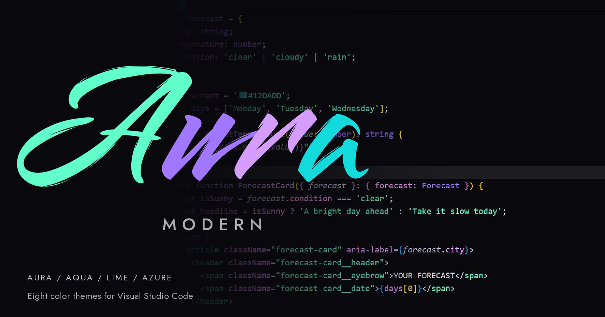
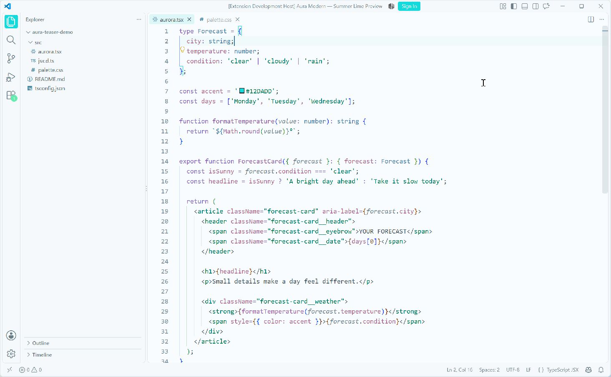
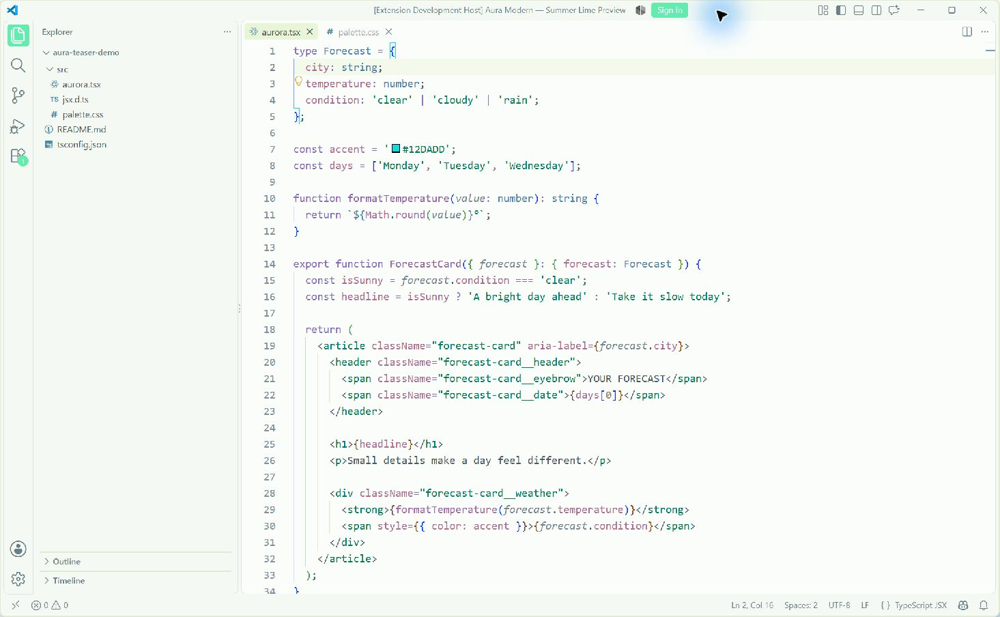

# Aura Modern



Eight themes for Visual Studio Code, with dark and light appearances in four families:

- **Aura** — purple and mint, with soft syntax colors.
- **Aqua** — cyan interactions, mint badges, and small citrus accents.
- **Lime** — mint and green-cyan, a touch of lemon, and pale green-white light surfaces.
- **Azure** — Microsoft Fluent blues on neutral surfaces.

An independent fork of [Aura by Dalton Menezes](https://github.com/daltonmenezes/aura-theme), maintained by [yukiumi13](https://github.com/yukiumi13). The original project's MIT license is preserved.

## Install

Install [Aura Modern from the VS Code Marketplace](https://marketplace.visualstudio.com/items?itemName=yukiumi13.aura-theme-2026), then run **Preferences: Color Theme** and choose an Aura theme. For a downloaded preview package, use **Extensions: Install from VSIX…**.

To follow your system appearance, enable **Window: Auto Detect Color Scheme** and choose your preferred light and dark themes in Settings. Saved selections for the six existing themes remain compatible; Lime is a separate choice.

## Previews

See [all eight themes in the VS Code gallery](packages/vscode/README.md#previews). The screenshots use a fictional sample workspace, with no personal files or account details.

### Aqua Light



### Lime Light



## Modern UI

On supported VS Code versions, enable **Workbench › Experimental: Modern UI**:

```json
{
  "workbench.experimental.modernUI": true
}
```

Aqua and Lime Light use white icons on the selected cyan or mint activity tile. Hovering over an unselected icon uses dark ink on a pale tile. Their dark appearances keep bright icons on subdued surfaces. The traditional interface is also supported; enabling Modern UI changes some of VS Code's layout and styling as well as these activity states.

## Other editors

This repository also maintains [Zed](packages/zed), [Ghostty](packages/ghostty), [Windows Terminal](packages/windows-terminal), and [WezTerm](packages/wezterm) packages. These ports retain their existing dark variant sets; the eight-theme lineup above is for VS Code.

See [GitHub Releases](https://github.com/yukiumi13/aura-theme-2026/releases) for bundles. Inherited upstream ports remain under `legacy/` and are outside the maintained build path.

## Development

Edit source palettes and roles under `src/core/colors`, then generate the packages:

```sh
yarn install --frozen-lockfile
yarn build only vscode
yarn test
node scripts/review-vscode-themes.js
```

The shared pipeline is **source colors → semantic roles → template variables → port templates → generated packages**. UI, syntax, and terminal ANSI colors have separate roles. Generated files in `packages/` should be rebuilt from source.

Every design iteration includes a review of the full generated configuration and actual UI against the relevant reference. The [review workflow](docs/THEME_REVIEW.md) covers visual hierarchy, color distribution, interaction states, syntax, and light/dark pairing.

- Design notes: [Aqua](docs/AQUA_DESIGN.md), [Lime](docs/LIME_DESIGN.md), [Azure](docs/AZURE_DESIGN.md).
- Latest interaction review: [Modern UI hover and selection](docs/reviews/2026-09-19-modern-activity-review.md).
- Zed setup: [semantic-token settings](packages/zed/semantic-token-settings.json) and [mapping notes](docs/ZED_SEMANTIC_TOKENS.md).
- Other builds: `yarn build only zed`, `ghostty`, `windows-terminal`, or `wezterm`.
- Release bundles: `yarn package:zed` and `yarn package:terminals`. The workflows under `.github/workflows` attach bundles to `v*` tag releases.

## Feedback

[Report an issue](https://github.com/yukiumi13/aura-theme-2026/issues) with the theme name, file type, and a screenshot. See the [VS Code changelog](packages/vscode/CHANGELOG.md) for release and upgrade notes.

## Credits and license

Based on Aura by Dalton Menezes and contributors. This fork maintains its own palette updates, paired appearances, port mappings, and branding.

The wordmark uses **Smooch** and **Jost**, both under the SIL Open Font License. See [branding sources and licenses](design/branding/README.md). Azure uses selected Microsoft Fluent color tokens; see [third-party notices](packages/vscode/THIRD_PARTY_NOTICES.md).

[MIT](LICENSE).
