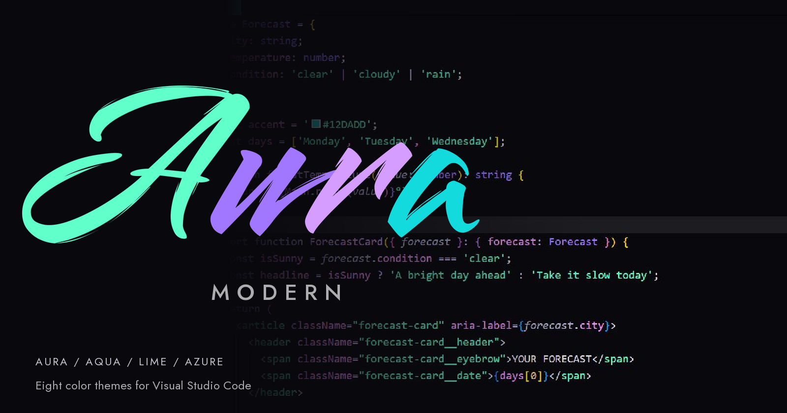
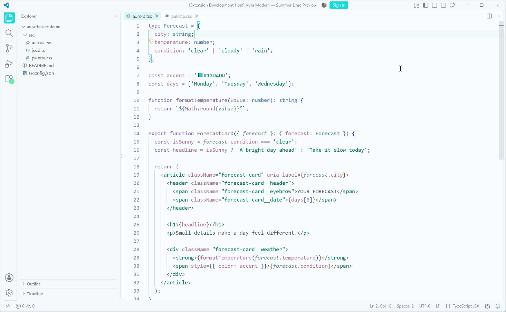
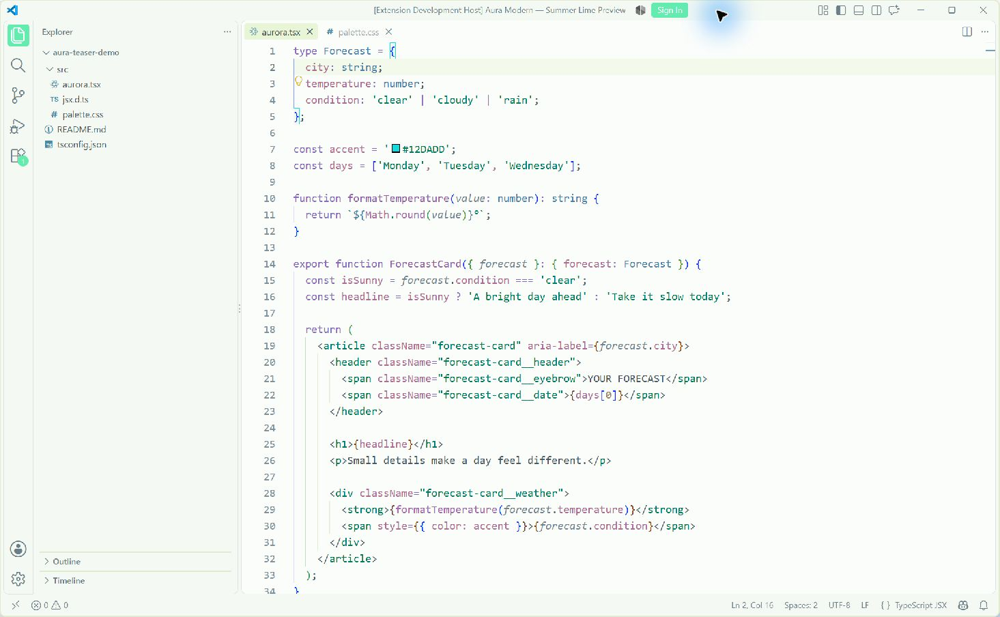

# Aura Modern



Nine themes for Visual Studio Code, with four dark/light pairs and an Aqua syntax variation:

- **Aura** — purple and mint, with soft syntax colors.
- **Aqua** — cyan interactions, mint badges, and small citrus accents.
- **Aqua Lime Light** — Aqua Light's interface with brighter summer syntax.
- **Lime** — mint and green-cyan, a touch of lemon, and pale green-white light surfaces.
- **Azure** — Microsoft Fluent blues on neutral surfaces.

An independent fork of [Aura by Dalton Menezes](https://github.com/daltonmenezes/aura-theme), maintained by [yukiumi13](https://github.com/yukiumi13). The original project's MIT license is preserved.

## Install

Install [Aura Modern from the VS Code Marketplace](https://marketplace.visualstudio.com/items?itemName=yukiumi13.aura-theme-2026), then run **Preferences: Color Theme** and choose an Aura theme. For a downloaded preview package, use **Extensions: Install from VSIX…**.

To follow your system appearance, enable **Window: Auto Detect Color Scheme** and choose your preferred light and dark themes in Settings. Existing theme selection IDs remain compatible.

All nine themes work without additional extensions. Aqua Light and Aqua Lime Light also offer [optional button, badge and focus effects](#optional-aqua-effects).

## Previews

See the [VS Code theme gallery](packages/vscode/README.md#previews). The screenshots use a fictional sample workspace, with no personal files or account details.

### Aqua Light



### Lime Light



## Modern UI

On supported VS Code versions, enable **Workbench › Experimental: Modern UI**:

```json
{
  "workbench.experimental.modernUI": true
}
```

Aqua and Lime Light use white icons on the selected cyan or mint activity tile. Hovering over an unselected icon uses dark ink on a pale tile. Their dark appearances keep bright icons on subdued surfaces. The traditional interface is also supported; enabling Modern UI changes some of VS Code's layout and styling as well as these activity states.

Aura defaults the Modern UI tab style to **Pill**, preserving theme-colored active tabs. Explicit User, Remote or Workspace settings take precedence. This editor-wide default works independently of the optional effects and does not enable Modern UI. See [tab setup](packages/vscode/README.md#modern-ui).

## Optional Aqua effects

**Aura Aqua Light** and **Aura Aqua Lime Light** can add:

- Mint/cyan primary buttons with a distinct cyan hover response.
- Cyan-to-green numeric activity badges with a fine white edge and soft glow.
- Shared cyan/mint/green focus rings on inputs, primary buttons, toolbar icons and notification cards, sized to suit each control.

These experimental effects are off by default. They require desktop VS Code and the separately installed [Custom CSS and JS Loader](https://marketplace.visualstudio.com/items?itemName=be5invis.vscode-custom-css) (`be5invis.vscode-custom-css`). The nine themes themselves need no additional extension. Aura does not bundle or automatically install the loader.

Enable **Aura › Experimental: Gradients**, run **Aura: Apply Gradient Setting**, and reload. After updating Aura or VS Code, apply and reload again. Set up the loader and effects on each computer; the switch does not sync. Remote SSH uses the loader on the local desktop.

The loader modifies VS Code installation files and can trigger its integrity warning. Before uninstalling Aura or the loader, turn the setting off, apply and reload. See [full setup, status and compatibility guidance](packages/vscode/README.md#optional-aqua-effects-desktop).

## Other editors

This repository also maintains [Zed](packages/zed), [Ghostty](packages/ghostty), [Windows Terminal](packages/windows-terminal), and [WezTerm](packages/wezterm) packages. These ports retain their existing dark variant sets; the nine-theme lineup above is for VS Code.

See [GitHub Releases](https://github.com/yukiumi13/aura-theme-2026/releases) for bundles. Inherited upstream ports remain under `legacy/` and are outside the maintained build path.

## Development

Edit source palettes and roles under `src/core/colors`, then generate the packages:

```sh
yarn install --frozen-lockfile
yarn build only vscode
yarn test
node scripts/review-vscode-themes.js
```

The shared pipeline is **source colors → semantic roles → template variables → port templates → generated packages**. UI, syntax, and terminal ANSI colors have separate roles. The VS Code port also compiles independent action, badge and focus roles into the optional stylesheet and a resolved effect inventory. Generated files in `packages/` should be rebuilt from source.

Every design iteration includes a review of the full generated configuration and actual UI against the relevant reference. The [review workflow](docs/THEME_REVIEW.md) covers visual hierarchy, color distribution, interaction states, syntax, and light/dark pairing.

- Design notes: [Aqua](docs/AQUA_DESIGN.md), [Lime](docs/LIME_DESIGN.md), [Azure](docs/AZURE_DESIGN.md).
- Latest interaction review: [shared Aqua focus roles](docs/reviews/2026-09-30-notification-focus.md).
- Zed setup: [semantic-token settings](packages/zed/semantic-token-settings.json) and [mapping notes](docs/ZED_SEMANTIC_TOKENS.md).
- Other builds: `yarn build only zed`, `ghostty`, `windows-terminal`, or `wezterm`.
- Release bundles: `yarn package:zed` and `yarn package:terminals`. The workflows under `.github/workflows` attach bundles to `v*` tag releases.

## Feedback

[Report an issue](https://github.com/yukiumi13/aura-theme-2026/issues) with the theme name, file type, and a screenshot. See the [VS Code changelog](packages/vscode/CHANGELOG.md) for release and upgrade notes.

## Credits and license

Based on Aura by Dalton Menezes and contributors. This fork maintains its own palette updates, paired appearances, port mappings, and branding.

The wordmark uses **Smooch** and **Jost**, both under the SIL Open Font License. See [branding sources and licenses](design/branding/README.md). Azure uses selected Microsoft Fluent color tokens; see [third-party notices](packages/vscode/THIRD_PARTY_NOTICES.md).

[MIT](LICENSE).
