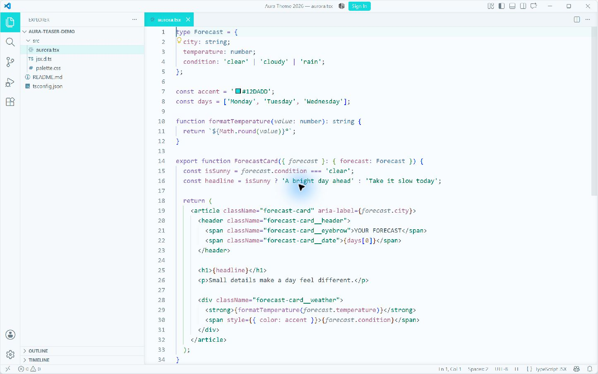
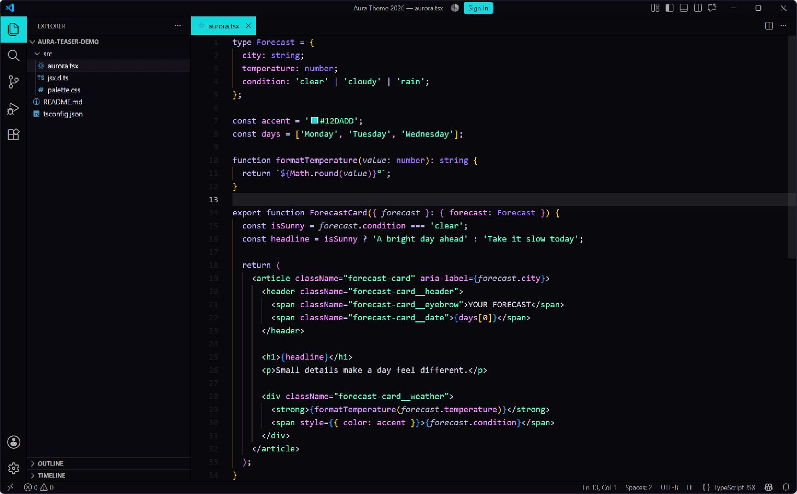

# Aura Aqua: design assessment and paired variants

The supplied screenshot's cyan and Aura mint can form a coherent analogous palette. The cyan is cooler and more synthetic; mint is greener and softer. Their closeness is useful for cohesion, but makes them a weak pair for distinguishing unrelated meanings by hue alone. Meaning should also come from placement, lightness, labels, and icons.

## What was measured

`docs/aqua-color-sampling.json` records source-image SHA-256, dimensions, color metadata, crop rectangles, and raw pixel counts. The reference is a 654 × 1098 RGBA PNG with an sRGB metadata chunk and gamma 0.45455; it has no embedded ICC profile. The sampler does not resize, quantize, or convert the image's color profile.

| Region | Frequent stored RGB values |
| --- | --- |
| Purchase button | `#12DADD`, `#11DADD`, `#13DADD` |
| Task button | `#0CDADD` through `#11DADD` |
| Progress bar | `#1ADBDE`, `#1BDBDE` |
| Paper | `#F8FCFE` |

`#12DADD` is the most common color within the recorded vivid-cyan filter (1,869 pixels), so it is used as a representative anchor. It is not claimed to be the original game's design token. Crop placement is a visual choice; color counts are direct measurements. Neighboring values can come from gradients, anti-aliasing, or earlier image processing. With Pillow available, reproduce the report with:

```sh
python scripts/sample-image-palette.py /path/to/reference.png --output /tmp/aqua-sampling.json
```

The anchor's HSV hue is approximately 180.9°, versus Aura mint's 159.9°. These are adjacent hues, not a complementary pair. White text on the sampled aqua has about 1.74:1 contrast. Aqua Light intentionally uses that white-on-aqua pairing for its high-emphasis controls to preserve the reference's airy Aura character. This sacrifices small-label legibility; ordinary text stays on pale surfaces. Aqua Dark retains dark text on aqua. The reference's artwork is not copied into the themes.

## Adopted interaction language for the default themes

Aqua is a distinct **interaction response** color. The light default keeps mint-filled normal actions, then uses the sampled aqua for hover with the same dark text. Dark themes use aqua for action/Remote hover and the UI hover/emphasis roles that previously borrowed mint. Ordinary light hover labels remain neutral, and light links/focus remain purple.

`semantic.interaction.accent` is independent of `brand.mint`, syntax, and success status. Dark normal action fills use the family accent so their dark labels remain readable before hover; compact status hover stays neutral. Existing TextMate, semantic syntax, and ANSI colors are unchanged.

## Implemented variant language

The appearances share an interaction language, with different palette foundations. Aqua Light uses its independently tuned ink colors on the sampled cold paper. Since v0.6.1, Aqua Dark derives its surfaces, foregrounds, syntax, and terminal colors directly from Aura Dark. This prevents the dark appearance from drifting into a blue-green inversion of the light reference.

The VS Code extension offers **Aura 2026 Aqua Light** and **Aura 2026 Aqua Dark**, with shared aqua actions, neutral interaction labels, and explicit status meanings. Their previous selection IDs remain stable.

| Meaning | Aqua Light | Aqua Dark |
| --- | --- | --- |
| Filled actions, active tabs, activity items, badges, Remote/SSH | `#12DADD` with white text | `#12DADD` with Aura ink `#09080D` text |
| UI links / hover | Soft blue `#4A80A7` / `#39749D` | Aqua `#12DADD` / `#76E9EC` |
| Types / constants | Soft blue `#4A80A7` | Aura purple `#A277FF` |
| Information icons | Soft blue `#4A80A7` | Aqua `#12DADD` |
| Control flow and operators | Soft violet `#8669BA` | Aura lavender `#C4B5FD` |
| Function calls / properties | Orchid `#A36CAF` / rose `#AD6B91` | Aura lavender `#D49DFF` / pink `#F694FF` |
| Numbers | Muted amber `#9C7954` | Aura amber `#FFCA85` |
| Strings / success | Readable Aura mint ink | Original Aura mint |
| Canvas | Sampled cold paper `#F8FCFE` | Aura Dark ink `#09080D` |
| Sidebar | Designed `#F5F9FB` | Aura Dark sidebar `#0A090F` |
| Ordinary hover | Neutral surface and foreground | Neutral surface and foreground |

Only the aqua anchor and cold-paper background are direct reference samples. Aqua Light's supporting colors and both appearances' aqua selection tints are design choices. Aqua Dark's base and syntax come from the existing Aura Dark source palette. White on vivid aqua is reserved for active light UI elements; Aqua Dark uses its near-black ink for the same controls.

## Visual quality review

The v0.5.0 pair made aqua feel incidental. Later revisions gave it a clearer interaction identity, but the lifted blue-green dark surfaces and brighter syntax drifted away from Aura Dark. The v0.6.1 correction restores Aura's foundations and evaluates these relationships:

- **Identity and color distribution:** aqua is visible in active tabs, activity items, progress, badges, and actions. It is concentrated in meaningful locations rather than tinting every surface or label.
- **Hierarchy:** the editor stays the largest calm surface; selected navigation has a solid aqua fill, floating surfaces remain distinct, and secondary content stays neutral. Unfocused groups lose the strong active fill.
- **Color purity:** Aqua Dark directly inherits Aura's near-black violet canvas and surface ramp. Aqua stays concentrated in interaction roles. Aqua Light retains its near-white surfaces and soft ink colors.
- **Interaction clarity:** buttons brighten on hover; ordinary rows use neutral opaque hover. Active foreground/background pairs are explicit. Graphic aqua accents are separate from readable light links and keyboard focus.
- **Reading quality:** check syntax and UI on their actual backgrounds, including selected, hovered, unfocused, and layered diff states. Aqua Light accepts a 3:1 design floor for ordinary colored text and deliberately exempts white text on vivid aqua. Aqua Dark uses 4.5:1 for primary text and 3:1 for its inherited subdued comments and dim terminal text. The latter is a visual design tradeoff, not a WCAG normal-text conformance claim.

VS Code's tab hover rules exclude selected tabs, so a selected aqua tab keeps its fill during hover. No custom CSS is installed into VS Code. The v0.6.1 correction changes only Aqua Dark's generated theme; the other five shipped themes retain their existing colors.

## Implementation and validation

- `source/aqua.ts` owns the aqua interaction colors, light palette, and selection tints. Aqua Dark references `auraBase2026`, `auraSemantic2026`, and `auraDefaultFamily` instead of keeping separate background and syntax literals. Original Aura mint remains a separate brand anchor.
- `createAuraPalette` consumes independent action and interaction semantics. Default hover uses the interaction accent, and custom Aqua action fills keep their own hover treatment.
- `create-aura-syntax.ts` owns the shared syntax mapping. `create-aqua-roles.ts` applies the light ink palette or the inherited Aura Dark syntax, retains Aura Dark's terminal/ANSI roles, and adds Aqua interactions, neutral hover, readable hints/inactive labels, restrained selections, and bounded diff tints. Compatibility aliases follow the structured roles.
- The same VS Code template generates all themes. The two new appearances are registered separately from legacy dark-only families, so other ports do not accidentally receive light metadata.
- Tests render the actual template, check manifest/output agreement, composite selections and diff layers, verify contrast for explicit syntax and interaction pairs, check agreement between TextMate and semantic highlighting, and confirm status colors are independent of ANSI overrides. A regression check compares Aqua Dark's semantic syntax, core surfaces, and terminal colors with Aura Dark. ANSI black remains a dark TUI background slot; dim text keeps Aura's subdued hierarchy.

## Real VS Code previews

These screenshots use a fictional sample workspace in an isolated, unsigned-in profile. Older illustrative PNGs in the assets directory are historical and do not represent the current Aqua Dark palette.




