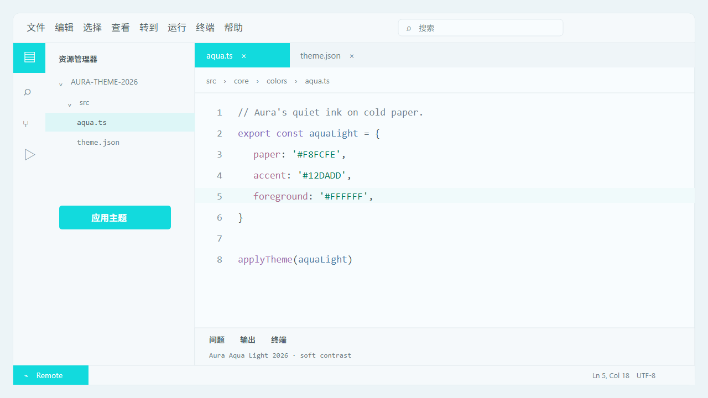
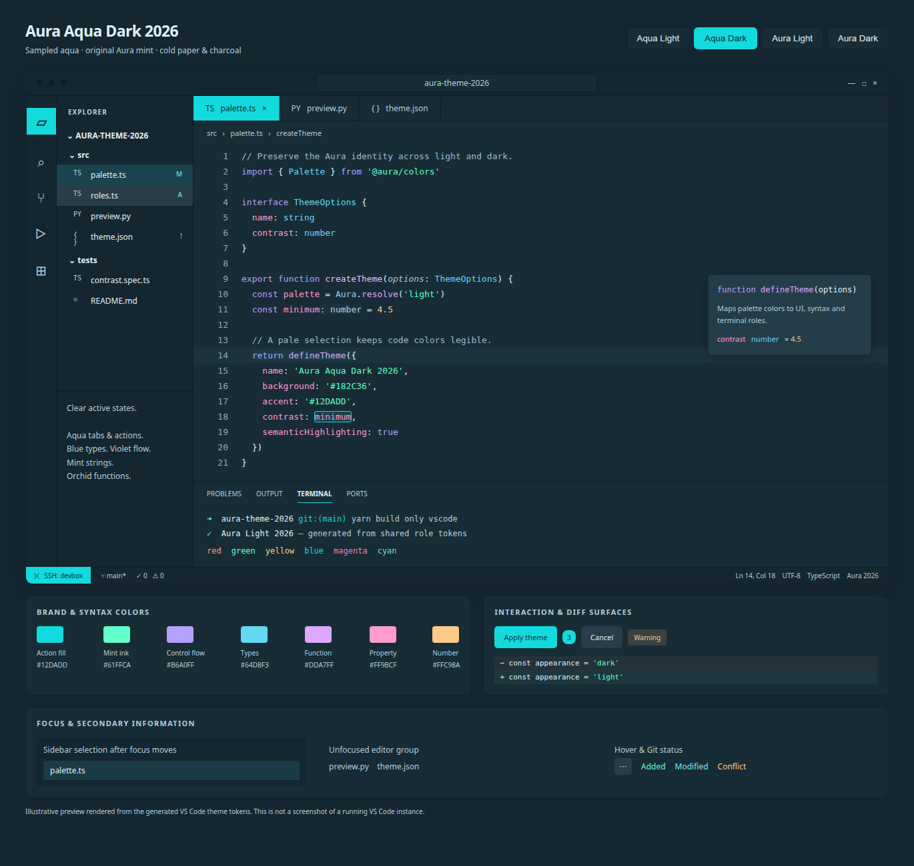

# Aura Aqua: design assessment and paired variants

The supplied screenshot's cyan and Aura mint can form a coherent analogous palette. The cyan is cooler and more synthetic; mint is greener and softer. Their closeness is useful for cohesion, but makes them a weak pair for distinguishing unrelated meanings by hue alone. Meaning should also come from placement, lightness, labels, and icons.

## What was measured

`docs/aqua-color-sampling.json` records source-image SHA-256, dimensions, color metadata, crop rectangles, and raw pixel counts. The reference is a 654 × 1098 RGBA PNG with an sRGB metadata chunk and gamma 0.45455; it has no embedded ICC profile. The sampler does not resize, quantize, or convert the image's color profile.

| Region | Frequent stored RGB values |
| --- | --- |
| Purchase button | `#12DADD`, `#11DADD`, `#13DADD` |
| Task button | `#0CDADD` through `#11DADD` |
| Progress bar | `#1ADBDE`, `#1BDBDE` |
| Paper | `#F8FCFE` |

`#12DADD` is the most common color within the recorded vivid-cyan filter (1,869 pixels), so it is used as a representative anchor. It is not claimed to be the original game's design token. Crop placement is a visual choice; color counts are direct measurements. Neighboring values can come from gradients, anti-aliasing, or earlier image processing. With Pillow available, reproduce the report with:

```sh
python scripts/sample-image-palette.py /path/to/reference.png --output /tmp/aqua-sampling.json
```

The anchor's HSV hue is approximately 180.9°, versus Aura mint's 159.9°. These are adjacent hues, not a complementary pair. White text on the sampled aqua has about 1.74:1 contrast. Aqua Light intentionally uses that white-on-aqua pairing for its high-emphasis controls to preserve the reference's airy Aura character. This sacrifices small-label legibility; ordinary text stays on pale surfaces. Aqua Dark retains dark text on aqua. The reference's artwork is not copied into the themes.

## Adopted interaction language for the default themes

Aqua is a distinct **interaction response** color. The light default keeps mint-filled normal actions, then uses the sampled aqua for hover with the same dark text. Dark themes use aqua for action/Remote hover and the UI hover/emphasis roles that previously borrowed mint. Ordinary light hover labels remain neutral, and light links/focus remain purple.

`semantic.interaction.accent` is independent of `brand.mint`, syntax, and success status. Dark normal action fills use the family accent so their dark labels remain readable before hover; compact status hover stays neutral. Existing TextMate, semantic syntax, and ANSI colors are unchanged.

## Implemented variant language

Each variant is evaluated for its own visual quality: surface hierarchy, code legibility, role separation, and the balance of cool and warm hues. Matching the default Aura syntax is not an acceptance criterion. The shared role function reuses the language mapping, while the Aqua source palette supplies independently tuned syntax accents and semantic colors for each appearance.

The VS Code extension adds **Aura Aqua Light 2026** and **Aura Aqua Dark 2026**. These are distinct from the older Aura Cyan dark-only accent variant: they have paired surfaces, shared aqua actions, neutral interaction labels, and explicit status meanings.

| Meaning | Aqua Light | Aqua Dark |
| --- | --- | --- |
| Filled actions, active tabs, activity items, badges, Remote/SSH | `#12DADD` with white text | `#12DADD` with `#07363A` text |
| UI links / hover | Soft blue `#4A80A7` / `#39749D` | Aqua `#12DADD` / `#76E9EC` |
| Types / constants | Soft blue `#4A80A7` | Sky blue `#64D8F3` |
| Information icons | Soft blue `#4A80A7` | Aqua `#12DADD` |
| Control flow and operators | Soft violet `#8669BA` | Violet `#B6A0FF` |
| Function calls / properties | Orchid `#A36CAF` / rose `#AD6B91` | Orchid `#DDA7FF` / rose `#FF9BCF` |
| Numbers | Muted amber `#9C7954` | Warm sand `#FFC98A` |
| Strings / success | Readable Aura mint ink | Original Aura mint |
| Canvas | Sampled cold paper `#F8FCFE` | Designed deep blue canvas `#182C36` |
| Chrome | Designed `#F5F9FB` | Designed `#142630` |
| Ordinary hover | Neutral surface and foreground | Neutral surface and foreground |

Only the aqua anchor and cold-paper background are direct reference samples. Hover, dark canvas, surface, and selection shades are design choices; they are not attributed to the reference UI. Aqua Light keeps the pale chrome and softens its foreground and syntax hues instead of adding a dark banner to imitate the reference's artwork. White on vivid aqua is reserved for active UI elements; subdued blue, violet, orchid, rose, and amber carry code meaning without making every token a hard accent. Dark syntax remains luminous against its deep blue canvas.

## Visual quality review

The v0.5.0 pair was readable but visually too subdued: gray-blue chrome, small isolated cyan controls, and softened syntax made the sampled aqua feel incidental. The revision evaluates more than brightness:

- **Identity and color distribution:** aqua is visible in active tabs, activity items, progress, badges, and actions. It is concentrated in meaningful locations rather than tinting every surface or label.
- **Hierarchy:** the editor stays the largest calm surface; selected navigation has a solid aqua fill, floating surfaces remain distinct, and secondary content stays neutral. Unfocused groups lose the strong active fill.
- **Color purity:** near-white light chrome and a clearer blue dark canvas replace the gray-blue/near-black pairing. Aqua Light uses softer blue, violet, orchid, rose, mint, and amber syntax roles.
- **Interaction clarity:** buttons brighten on hover; ordinary rows use neutral opaque hover. Active foreground/background pairs are explicit. Graphic aqua accents are separate from readable light links and keyboard focus.
- **Reading quality:** check syntax and UI on their actual backgrounds, including selected, hovered, unfocused, and layered diff states. Aqua Light accepts a lower 3:1 floor for ordinary colored text, and deliberately exempts white text on vivid aqua from that floor. Aqua Dark retains the 4.5:1 text floor.

VS Code's current tab hover rules exclude selected tabs, so a selected aqua tab keeps its fill during hover. The preview follows this behavior. No custom CSS is installed into VS Code. The new role aliases preserve the outputs of the 15 non-Aqua themes, including Aura Light 2026.

## Implementation and validation

- `source/aqua.ts` owns the anchor, tonal colors, neutral palettes, UI families, syntax accents, and semantic brand/action/status assignments. Original Aura mint remains a separate brand anchor.
- `createAuraPalette` consumes independent action and interaction semantics. Default hover uses the interaction accent, and custom Aqua action fills keep their own hover treatment.
- `create-aura-syntax.ts` owns the shared syntax role mapping within the existing role layer. `create-aqua-roles.ts` supplies Aqua's own type/control accents and appearance-specific semantic palette, and assigns neutral hover, readable hints/inactive labels, cool selections, and bounded diff tints. UI and syntax can be tuned separately without fixing either to the default theme. Compatibility aliases follow the structured roles.
- The same VS Code template generates all themes. The two new appearances are registered separately from legacy dark-only families, so other ports do not accidentally receive light metadata.
- Tests render the actual template, check manifest/output agreement, composite selections and diff layers, verify contrast for explicit syntax and interaction pairs, check agreement between TextMate and semantic highlighting, and confirm status colors are independent of ANSI overrides. ANSI black remains a dark TUI background slot in the dark appearance; other foreground slots and the black/white pair are checked for readability.

The accompanying preview is an illustration rendered from the generated theme values, not a screenshot of a running VS Code instance.

## Rendered previews




