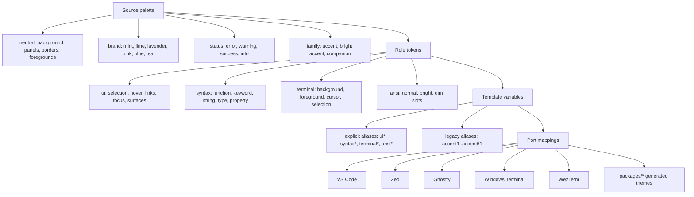

# Aura 2026 Color Architecture

Aura 2026 is now described as three conceptual layers plus a temporary template-alias adapter. The goal is to keep color decisions centralized while allowing existing Mustache templates to migrate away from numeric `accentXX` variables gradually.

## Flow Chart

## Source Palette

- `src/core/colors/source/aura.ts`
  - Owns fixed Aura colors: ink-black neutrals, brand colors, status colors, and the default family.
  - Background and neutral foreground colors should stay stable across variants unless the whole surface system is deliberately changed.

- `src/core/colors/source/variants.ts`
  - Owns accent families such as azure, cyan, blue, violet, rose, amber, teal, and graphite.
  - A variant supplies only accent, bright accent, soft accent, and companion colors.

## Role Tokens

- `src/core/colors/roles/create-aura-roles.ts`
  - Turns source colors into `ui`, `syntax`, `terminal`, and `ansi` roles.
  - This is the main place to tune visual behavior such as function colors, selection colors, link hover colors, and terminal ANSI choices.

- `src/core/colors/roles/types.ts`
  - Defines the source and role token interfaces.

## Template Variables

- `src/core/colors/template-vars/create-template-vars.ts`
  - Converts role tokens into flat Mustache variables used by the current template engine.
  - Explicit aliases such as `syntaxFunctionDeclaration`, `uiEditorSelection`, and `ansiBrightGreen` are preferred for new templates.
  - Numeric `accentXX` aliases exist only for compatibility with inherited templates. They are not source palette names and should not be used for new ports.

- `src/core/colors/palettes/*`
  - Compatibility re-exports for older imports. Prefer `source`, `roles`, and `template-vars` for new code.

## Port Mapping

- VS Code
  - `src/ports/vscode/templates/theme.json`
  - Maps VS Code UI keys, TextMate scopes, semantic token colors, and integrated terminal colors to template variables.

- Zed
  - `src/ports/zed/templates/theme.json`
  - Maps Zed UI keys, syntax styles, semantic-token style targets, and terminal colors to template variables.

- Terminal ports
  - `src/ports/ghostty/templates/aura-theme.conf`
  - `src/ports/windows-terminal/templates/aura-theme.json`
  - `src/ports/wezterm/templates/aura-theme.lua`
  - Terminal ANSI colors come from explicit `ansi*` variables so bright colors stay aligned with their normal hue.

## Variant Rules

Keep these stable:

- editor and terminal background
- neutral foreground and muted foreground
- comments
- red/error
- yellow/warning
- green/success

Allow these to vary:

- UI accent
- cursor and focus border
- links
- selection tint
- terminal blue, magenta, cyan
- syntax keyword, operator, type, property, decorator

Do not make every syntax role use the variant accent. Aura variants should feel like the same theme family with different accents, not unrelated themes.
