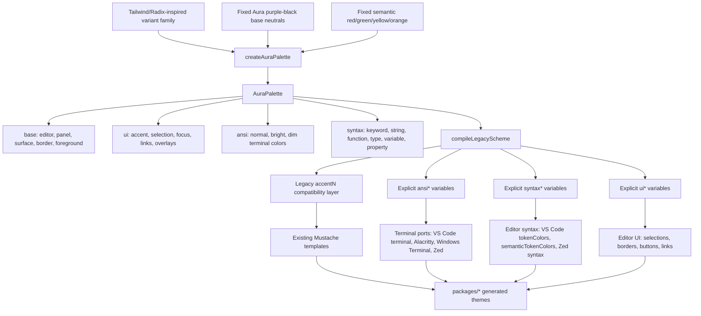

# Aura 2026 Color Architecture

Aura 2026 keeps the editor background, purple-black neutral surfaces, semantic
status colors, terminal ANSI roles, and syntax roles separate. Variants should
change the accent family, not the whole theme.

## Flow Chart

## Source Layers

- `src/core/colors/palettes/base.ts`
  - Owns Aura 2026 fixed purple-black neutrals and status colors.
  - Background and foreground colors should stay stable across variants.
  - Also owns `auraInkBase2026`, a darker near-black base for `Aura Ink 2026`.
  - Accent families also generate `Ink` variants, such as
    `Aura Azure Ink 2026` and `Aura Cyan Ink 2026`.

- `src/core/colors/palettes/variants.ts`
  - Owns accent families such as azure, cyan, blue, violet, rose, amber, teal,
    and graphite.
  - A variant only supplies accent, bright accent, soft accent, and companion
    colors.

- `src/core/colors/palettes/create-aura-palette.ts`
  - Turns a variant family into UI, ANSI, and syntax roles.
  - This is the main place to tune how Tailwind/Radix-style colors combine with
    Aura.

- `src/core/colors/palettes/compile-legacy-scheme.ts`
  - Converts semantic Aura roles into the existing `accent1..accent61`
    replacement object.
  - Also exposes explicit `ansi*`, `syntax*`, and `ui*` variables so templates
    can migrate away from numeric accents over time.

## Port Mapping

- VS Code
  - `src/ports/vscode/templates/theme.json`
  - Uses explicit `terminal.ansi*` variables and semantic `syntax*` variables
    for token colors where practical.

- Zed
  - `src/ports/zed/templates/theme.json`
  - Uses explicit `terminal.ansi.*` variables and semantic `syntax*` variables.
  - The syntax keys follow the more detailed Zed-style semantic structure used
    by themes such as One Dark Pro, but colors are still generated from Aura
    roles.

- Terminal ports
  - `src/ports/alacritty/templates/aura-theme.toml`
  - `src/ports/windows-terminal/templates/aura-theme.json`
  - ANSI colors now come from explicit `ansi*` variables so bright colors stay
    aligned with their normal hue.

## Variant Rules

Keep these stable:

- editor and terminal background
- neutral foreground and muted foreground
- comments
- red/error
- yellow/warning
- green/success

Allow these to vary:

- UI accent
- cursor and focus border
- links
- selection tint
- terminal blue, magenta, cyan
- syntax keyword, operator, type, property, decorator

Do not make every syntax role use the variant accent. Aura variants should feel
like the same theme family with different accents, not unrelated themes.
