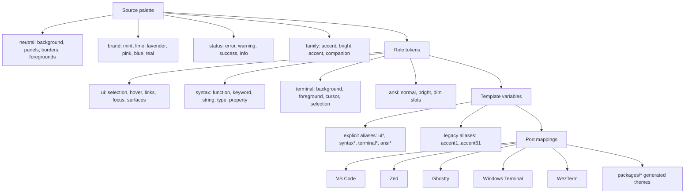

# Aura 2026 Color Architecture

Aura 2026 maps raw source colors through semantic palettes and role tokens to app-specific tokens, with a temporary template-alias adapter. The goal is to keep color decisions centralized while allowing existing Mustache templates to migrate away from numeric `accentXX` variables gradually.

## Flow Chart

```mermaid
flowchart TD
  A[Source palette] --> A1[neutral: background, panels, borders, foregrounds]
  A --> A2[brand: mint, lime, lavender, pink, blue, teal]
  A --> A3[status: error, warning, success, info]
  A --> A4[family: accent, bright accent, companion]

  A --> B[Role tokens]

  B --> B1[ui: selection, hover, links, focus, surfaces]
  B --> B2[syntax: function, keyword, string, type, property]
  B --> B3[terminal: background, foreground, cursor, selection]
  B --> B4[ansi: normal, bright, dim slots]

  B --> C[Template variables]
  C --> C1[explicit aliases: ui*, syntax*, terminal*, ansi*]
  C --> C2[legacy aliases: accent1..accent61]

  C --> D[Port mappings]
  D --> D1[VS Code]
  D --> D2[Zed]
  D --> D3[Ghostty]
  D --> D4[Windows Terminal]
  D --> D5[WezTerm]

  D --> E[packages/* generated themes]
```

## Source Palette

- `src/core/colors/source/aura.ts`
  - Owns fixed Aura colors: ink-black neutrals, brand colors, status colors, and the default family.
  - Background and neutral foreground colors should stay stable across variants unless the whole surface system is deliberately changed.

- `src/core/colors/source/variants.ts`
  - Owns accent families such as azure, cyan, blue, violet, rose, amber, teal, and graphite.
  - A variant supplies only accent, bright accent, soft accent, and companion colors.

- `src/core/colors/source/light.ts`
  - `auraLightColors` contains explicit daylight source colors; no runtime inversion or port-specific color literals.
  - `auraLightBase2026`, `auraLightSemantic2026`, and `auraLightFamily` map those colors to neutral, brand/status, and accent meanings.
  - The `Bright` fields mean emphasis within an appearance. For light themes they can be darker, rather than higher-luminance pastels.

## Role Tokens

- `src/core/colors/roles/create-aura-roles.ts`
  - Turns source colors into `ui`, `syntax`, `terminal`, and `ansi` roles.
  - This is the main place to tune visual behavior such as function colors, selection colors, link hover colors, and terminal ANSI choices.

- `src/core/colors/roles/types.ts`
  - Defines the source and role token interfaces.

## Template Variables

- `src/core/colors/template-vars/create-template-vars.ts`
  - Converts role tokens into flat Mustache variables used by the current template engine.
  - Explicit aliases such as `syntaxFunctionDeclaration`, `uiEditorSelection`, and `ansiBrightGreen` are preferred for new templates.
  - Numeric `accentXX` aliases exist only for compatibility with inherited templates. They are not source palette names and should not be used for new ports.

- `src/core/colors/palettes/*`
  - Compatibility re-exports for older imports. Prefer `source`, `roles`, and `template-vars` for new code.

## Port Mapping

- VS Code
  - `src/ports/vscode/templates/theme.json`
  - Maps VS Code UI keys, TextMate scopes, semantic token colors, and integrated terminal colors to template variables.

- Zed
  - `src/ports/zed/templates/theme.json`
  - Maps Zed UI keys, syntax styles, semantic-token style targets, and terminal colors to template variables.

- Terminal ports
  - `src/ports/ghostty/templates/aura-theme.conf`
  - `src/ports/windows-terminal/templates/aura-theme.json`
  - `src/ports/wezterm/templates/aura-theme.lua`
  - Terminal ANSI colors come from explicit `ansi*` variables so bright colors stay aligned with their normal hue.

## Variant Rules

Keep these stable:

- editor and terminal background
- neutral foreground and muted foreground
- comments
- red/error
- yellow/warning
- green/success

Allow these to vary:

- UI accent
- cursor and focus border
- links
- selection tint
- terminal blue, magenta, cyan
- syntax keyword, operator, type, property, decorator

Do not make every syntax role use the variant accent. Aura variants should feel like the same theme family with different accents, not unrelated themes.

## Light Appearance

`createAuraPalette(family, baseOverride?, appearance = 'dark')` selects the neutral and semantic palette for an appearance. Existing callers continue to use the dark palette. `schemes/light.ts` explicitly selects `auraLightFamily` and the light appearance, then uses the same role resolver and template-variable adapter as the dark variants.

The light theme is currently registered only by the VS Code port, with `type: "light"` and extension `uiTheme: "vs"`. It is not appended to the dark accent-family array, so other ports do not accidentally render a light palette under dark appearance metadata.

The daylight hierarchy is:

| Role | Color | Purpose |
| --- | --- | --- |
| Editor | `#F8F9FA` | Soft neutral canvas |
| Sidebar, activity bar, status bar | `#F0F2F5` | Slightly darker chrome |
| Inactive tabs | `#E7EBF0` | Distinct tab strip |
| Floating widgets | `#FFFFFF` | Elevated surface with a translucent shadow |
| Main text | `#30323C` | Neutral ink with a subtle violet bias |
| Focus / links / types | `#7043C1` | Aura purple |
| Primary actions / badges | `#61FFCA` fill / `#123B2D` text | Exact original mint with dark ink |
| Remote / SSH status item | `#61FFCA` fill / `#123B2D` text | Same filled action language as buttons and badges |
| Function calls / declarations | `#8541B2` / `#7934A8` | Lavender family |
| Strings | `#007A58` | Daylight mint |
| Properties / decorators | `#A23098` | Daylight pink |
| Numbers | `#9A5B15` | Warm amber |
| Comments | `#606C78` | Quiet neutral ink with readable contrast |

Appearance-specific choices live in roles: chrome boundaries are separate from widget shadows; guides and line numbers are separate from disabled text; solid fills have explicit contrast foregrounds; selection and diff opacity is lower on light paper. The shared VS Code template has no hard-coded hex colors. Legacy numeric aliases remain available to inherited ports.

The shared TextMate map now assigns `constant.numeric` to `syntaxNumber`, matching semantic highlighting when no language server supplies number tokens. Existing dark UI colors and pre-existing syntax mappings remain unchanged.

### Brand mint versus text ink

`auraMint` in `source/aura.ts` owns the original `#61FFCA` anchor shared by both appearances. The semantic brand palette exposes four distinct purposes: `mint` (identity), `mintText` (readable ink), `mintHover` (filled-control state), and `onMint` (contrast foreground). Light actions and badges use the original color, while syntax strings/tags, success diagnostics, and terminal green use the ink. Adjusting one must not silently change the others.

Actions and badges have explicit foreground/background pairs. Primary, secondary, and extension-marketplace buttons use transparent decorative borders in the light appearance; the purple keyboard focus indicator remains. A bright fill uses dark ink for both normal and hover states because VS Code does not provide a separate button-hover foreground. Remote/SSH status items follow the same mint-fill, dark-ink pairing. Ordinary compact status items retain a neutral hover surface.

`ui.interactionForeground` keeps ordinary hovered/focused list labels, menu items, tab titles, and breadcrumbs neutral. `ui.highlight.foreground` is reserved for search-match and other semantic emphasis and uses purple in the light appearance. Light neutral hover fills are opaque so they do not pick up a tint from the underlying surface; links remain purple on hover. Status decorations such as Git additions retain their own semantic colors during ordinary hover states.

The surfaces follow a calm neutral hierarchy, inspired by Material's semantic surface/container roles. Purple is concentrated in focus, links, and syntax rather than a wash across the entire workspace. No text glow, custom CSS injection, or additional runtime extension is required.

### Focus, secondary content, and status

Unfocused tab labels use `ui.chrome.unfocusedTabForeground`, a readable secondary ink rather than disabled text. `ui.selectionRole.listInactive` keeps a subtle violet selection after focus moves to the editor. Tab and toolbar hover roles share the neutral row hover fill, with transparent tab hover borders; active and keyboard focus indicators remain purple. `ui.editorDecoration.inlayHintForeground` uses secondary text so generated hints remain subordinate to source code.

UI success indicators, Git additions, chat additions, and inserted diff text use `ui.status.success` from semantic status green. Git conflicts use `ui.status.conflict` (strong orange for light); ordinary modifications remain purple. Neither depends on an ANSI slot. The VS Code port explicitly keeps the existing dark accent variants on `ui.status.successBright` to preserve their historical lime success color, independently of terminal ANSI. All 16 integrated-terminal ANSI slots remain unchanged.

### References and design choices

The references were inspected on September 15, 2026. They inform the surface hierarchy and light/dark translation, while this repository's Aura roles determine the actual hues:

- [Upstream Aura palette](https://github.com/daltonmenezes/aura-theme/blob/main/src/core/colors/schemes/common.ts): original purple, mint, lime, pink, and warm orange relationships.
- [VS Code Light Modern](https://github.com/microsoft/vscode/blob/main/extensions/theme-defaults/themes/light_modern.json) and [Dark Modern](https://github.com/microsoft/vscode/blob/main/extensions/theme-defaults/themes/dark_modern.json): editor/chrome/tab/widget hierarchy, contrast foregrounds on buttons, and mode-specific selection surfaces.
- [Coolnight Light](https://github.com/kpatdev/coolnight/blob/HEAD/coolnight-theme/themes/coolnight-light-color-theme.json) (`kpatdev.coolnight-theme`): community Aura-adjacent reference. This implementation keeps the local lavender-function design and Aura hue relationships.

- [Material 3 color roles](https://m3.material.io/styles/color/roles): separate surfaces, containers, and their contrast foregrounds. The specific neutral values in this repository are design choices for Aura, not a claimed universal Google palette.
- [Google Colab's redesigned editor](https://developers.googleblog.com/fully-reimagined-ai-first-google-colab/): a Google code-interface reference; this is not a port of its theme.

### Validation

`tests/unit/ports/vscode/light-theme.spec.ts` renders the actual shared template and verifies generated output and manifest registration. Contrast checks use sRGB relative luminance and alpha compositing, with a 4.5:1 floor for all explicit syntax foregrounds, all 16 ANSI slots, and the tested button/badge/list/menu/status pairs, including prominent and hover states. Keyboard focus indicators are checked at 3:1 against the editor and chrome backgrounds; primary, secondary, and marketplace button borders are checked to remain transparent. Syntax checks cover the editor, current line, selection, search match, range highlight, and diff line plus word overlays. Further checks cover unfocused tab text, persistent inactive selection, readable Git decorations on selected/hovered rows, secondary inlay text, and independence from ANSI overrides. This is a bounded color check, not a claim that every possible extension, grammar, or combination of VS Code decorations has been visually tested.
