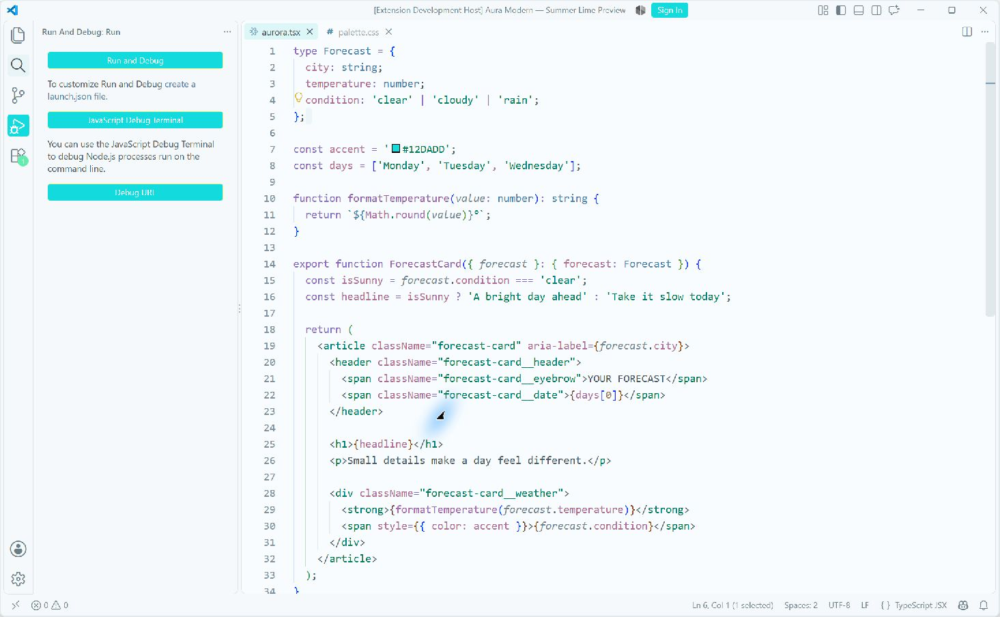
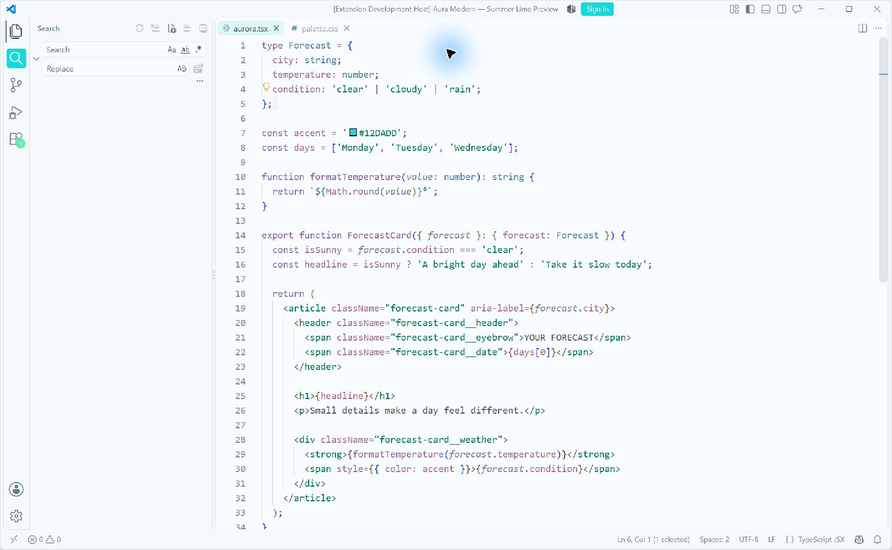

# Modern UI activity states — 2026-09-19

## Result

**Aqua Light now preserves white selected activity icons while keeping
unchecked hover and keyboard focus visible.** The real VS Code sequence was
verified by moving the pointer onto Search without clicking, then clicking it.
Lime Light follows the same state distinction with mint selection. Both dark
appearances keep bright family-colored icons on subdued selected surfaces.

Package: **0.7.0 preview3**. VS Code: **1.138.0**, experimental Modern UI enabled
in the isolated fictional preview profile. The review inventory contains eight
themes, 3,808 UI entries, 368 TextMate rules, and 240 semantic tokens. Exact
payload hashes are in [resolved-themes.json](resolved-themes.json); full config
specimens are in [resolved-themes.html](resolved-themes.html).

## Resolved state pairs

| Theme | Selected background / icon | Unchecked hover background / icon |
| --- | --- | --- |
| Aqua Light | `#12DADD` / `#FFFFFF` | `#E8F4F5` / `#394952` |
| Aqua Dark | `#13282D` / `#12DADD` | `#1B1724` / `#12DADD` |
| Lime Light | `#64EBAF` / `#FFFFFF` | `#EDF5EA` / `#394952` |
| Lime Dark | `#17352F` / `#64EBAF` | `#1B1724` / `#64EBAF` |

Aura and Azure receive explicit Modern UI slots derived from their existing
selected activity roles and hover surfaces. Every previously generated UI
value, TextMate rule, and semantic token remains unchanged in all eight themes.

## Design review against the summer reference

The supplied reference uses cyan for frequent interactions, mint for a smaller
contrasting emphasis, and restrained warm details. Aqua Light's new pale hover
tile signals pointer proximity while the saturated cyan tile identifies the
selected view. The white selected icon retains the reference's soft luminous
character. Hover occupies one small tile and does not spread a new green tint
over the reading surface. Mint badges remain distinct from cyan actions.

Lime Light retains its deliberately greener balance. Lime Dark's long citrus
outline around the focused Extensions search field was visible in the native
view; in that inspected layout it remained a thin secondary accent. Larger
dialogs still need separate evaluation. The dark pair's neutral hover tiles
fit the existing violet-black foundation.

## Runtime issue caught and corrected

The first implementation gave dark Modern UI selection a bright fill and dark
ink. Native inspection revealed that VS Code's later theme-generated classic
`activityBar.activeBackground` rule could override that fill. The icon then
became dark on a dark selected surface.

The final design keeps classic and Modern UI selected backgrounds identical,
using bright icons on dark tints. A regression assertion checks that background
agreement in addition to hover visibility. Light selection still uses its
existing cyan/mint fill, so independent white selected icons work as intended.
This finding came from native UI review after the first test run passed.

## Actual UI evidence

All captures use the fictional sample workspace and show no account details.

### Pointer over Search, before clicking

Search has a dark icon on a pale hover tile; Run and Debug remains selected
with a white icon on cyan.

### After selecting Search

Search has a white icon on cyan. The Focus Activity Bar command subsequently
placed keyboard focus on the unselected Explorer icon, which remains dark on
the pale rail with a visible focus marker.

Also inspected: Aqua/Lime Dark and Lime Light in the Extensions/TSX layout,
including selected Extensions and unchecked Search hover. Aqua Light's Run and
Debug actions and Command Palette were observed during the interaction check.
The traditional foreground mapping is unchanged and remains covered by the
unchecked-hover regression checks and the previous native review.

## Verification and scope

- Build completed; all 242 tests and TypeScript checking passed on the initial
  implementation. After the native correction, the affected Aqua/Lime suite
  passed all 143 tests.
- Packaged `aura-modern-v0.7.0-preview3.vsix`, 16 files, approximately 98 KB.
- All existing palette values, syntax rules, and classic UI values are
  unchanged. Four Modern UI slots were added; the new pale cyan hover is
  confined to the activity role.
- The chart-purple and unfocused modified-tab findings from the
  [initial audit](2026-09-19-theme-review.md) remain separate follow-ups.
- Connected SSH, disabled actions, broader language/diff coverage, and fresh
  Aura/Azure native Modern UI checks remain outside this interaction review.

The preview profile has Modern UI enabled. The theme package supplies colors;
it does not change the user's global experimental-UI preference.
